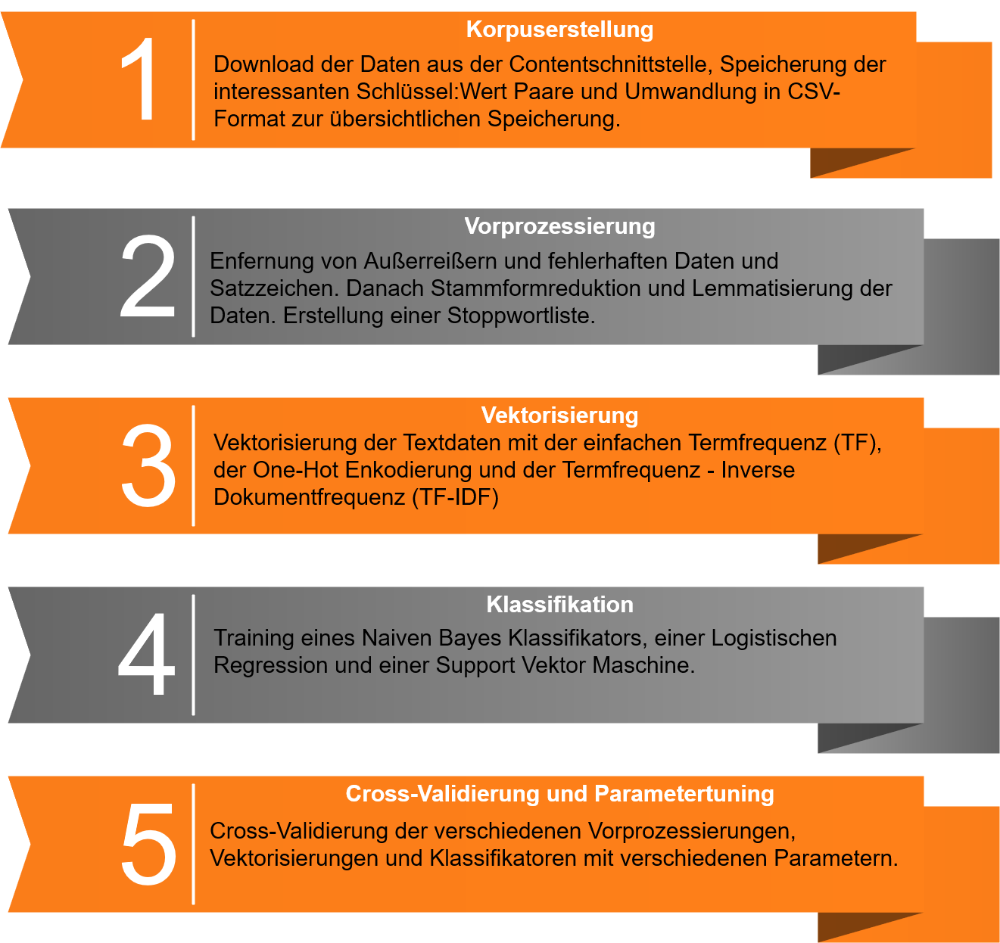

## Abstract

In dieser Arbeit werden drei grundprimitive Algorithmen zur Kategorisierung von Textdaten auf Inhalte der ZDF-Mediathek angewendet und verglichen. Unter anderem wird die Klassifikationsleistung vom Naiven Bayes Algorithmus (NB), der Logistischen Regression (LOG) und von Support Vektor Maschinenen (SVM) evaluiert. Dabei werden außerdem verschiedenene Vorprozessierungsschritte und Vektorisierungsmethoden getest. Neben dem Einfluss von Stoppwortlisten, der Stammformreduktion oder der Lemmatisierung werden als Vektorisierungsmethoden die Termfrequenz, die One-Hot Enkodierung und das TF-IDF-Maß erklärt und verglichen. Dazu werden Metadaten der Kategorie Dokumentation aus der Contentschnittstelle des ZDFs geladen. Diese unterteilt sich in diverse Sendungsreihen, die wiederum aus mehreren Rubriken und Sendungen bestehen. Die in den Metadaten enthaltenen textuellen Feature dienen als Grundlage, für den Kategorisierungsprozess.
Einerseits ermöglicht die ausführliche theoretische Ausarbeitung der Technologien und die Arbeit auf echten Daten, den Kategoriserungsprozess zu verstehen. Dadurch können Interessierte den Prozess auf andere Problemstellungen und Daten übertragen. Andererseits wird untersucht, welche Kombination aus Vorprozessierung, Vektorisierung und Klassifikation die besten Ergebnisse für das domänenspezifische Datenset liefert.
Die Ergebnisse zeigen, dass die Logistische Regression mit der TF-IDF Enkodierung die besten Ergebnisse liefert. Insbesondere der Abstand zur Leistung von Support Vektor Maschinen ist aber gering. Nur der Naive Bayes schneidet deutlich schlechter ab, als die anderen beiden.

### Datengrundlage

Die ZDF-Mediathek ist in mehrere größerer Rubriken mit vielen Unterkategorien, Sedungsreihen und Einzelsendungen aufgeteilt. Für den Vergleich der verschiedenen Klassifikatoren werden nur Sendungen der Rubrik _Dokumentation_ verwendet, da diese wegen ihrer inhaltlichen Heterogenität besonders spannend ist. Insgesamt besteht der Datensatz aus **6056** Sendungen aufgeteilt auf **10** Sendungsreihen. Die Anzahl der Sendungen ist dabei verzerrt. Sie variiert je nach Reihe von **18** bis zu **1949** Sendungen. Das Vokabular des Korpus besteht aus **105.713** Types und insgesamt **1.427,596** Millionen Tokens. Die durchschnittliche Länge pro Text einer Sendung beträgt **235,74** Tokens. Sendungen werden mit Tags metakodiert. Die Tags beschreiben dabei strukturelle Merkmale einer Sendungen oder ihren Inhalt.

### Klassifikationsprozess

### Ergebnisse 

|              |Precision          |Recall            |F1               |
|--------------|-------------------|------------------|-----------------|
|Klassifikator |NB  -   LOG -   SVM|NB  -   LOG -   SVM|NB  -   LOG -   SVM|    
|Vektorisierung|TF  -   TFIDF   -   TF|TF  -   TFIDF   -   TF|TF  -   TFIDF   -   TF|    
|Micro         |                   |                  |0,67 -   **0,78**    -   0,73|    
|Macro         |0,63    -   **0,81**    -   0,74|0,45   -   0,57    -   **0,62**|0,43   -   0,62    -  **0,66**|    
|Weighted      |0,65    -   **0,79**    -   0,73|0,67   -   **0,78**    -   0,73|0,63   -   **0,76**    -   0,72|      
   
Die Ergebnisse legen nahe, dass beim Klassifkationsprozess vor allem die zugrundeligenden Daten den größten Unterschied ausmachen. Je nach Klasse unterscheidet sich die Leistung der Klassifikatoren enorm. Auf der technischen Seite scheint die Wahl des Klassifikators den größten Ausschlag zu geben. Für die hier genutzten Daten ist wichtig, auf welche Klassen mehr Wert gelegt werden soll. Außerdem ist das Maß und die Gewichtungsmethode bei der Wahl des Klassifikators entscheidend. Infrequentere Klassen werden am besten von einer Support Vektor Maschine kategorisiert. Darauf deuten die Ergebnisse des Recalls und des F1-Maßes hin. Diese sind im macro-gemittelten Wert für diesen Klassifikator am höchsten. Die Logistische Regression überzeugt dagegen vor allem bei Klassen mit vielen Trainingsdaten. Im micro-gemittelten und im nach Trainingsdaten gewichtetetn Wert erzielt sie die besten Ergebnisse.
Insgesamt werden die Beobachtungen in der Fachliteratur bestätigt, dass der Naive Bayes im Vergleich zu anderen Klassifikatoren schlechter abschneidet. Dabei ist es nicht relevant, welche Vektorisierung oder Vorprozessierung verwendet wird. Letztere hat grundsätzlich wenig Einfluss auf die Leistung, sodass der hohe Zeitaufwand nicht gerechtfertigt ist.
Entgegen dem allgemein Konsens, liefert das TF-IDF-Maß als Vektorisierungsmethode nicht zwangsläufig bessere Ergebnisse, als andere Methoden. Nur die Logistische Regression erzielt damit die Besten. Vor allem in Kombination mit dem Naiven Bayes fällt die Leistung schlechter aus. Dies kann damit zusammenhängen, dass der Trainingskorpus insgesamt wenig Daten enthält. Als generativer Klassifikator besitzt der Naive Bayes möglicherweise nicht genug Daten, um ein Modell zu bauen, dass die einzelnen Klassen gut abbildet. Zusätzlich tauchen relevante Wörter einzelner Klassen eventuell zu häufig auf, sodass sie nur ein niedriges Gewicht vom TF-IDF Maß zugeschrieben bekommen. Hier punktet dann die Termfrequenz als Vektorisierung. Bei Verwendung letzterer oder auch bei der One-Hot Enkodierung liegt der Naive Bayes hingegen nahezu auf demselben Niveau wie die anderen Klassifikatoren mit denselben Vektorisierungsmethoden. Dass die SVM besser mit der Termfrequenz funktioniert, bestätigt die Theorie.
Großen Einfluss hat letztlich die Datengrundlage. Für viele Klassen scheinen nicht genug Daten vorhanden zu sein. Die trainierten Modelle passen sich zwar gut an die Daten an, da für die meisten Klassen akzeptable Werte bei der Precision erzielt werden. Dafür verfehlen sie für viele Klassen ungesehene Daten richtig zu kategorisieren. Das wird an den Werten für den Recall deutlich.
Um bessere Ergebnisse erzielen zu können, müssen mehr Daten für die jeweiligen Klassen vorhanden sein. Dann empfehlen sich vor allem die Logistische Regression und die Support Vektor Maschine als Klassifikator. Anders als der Naiven Bayes nutzen diese beiden Klassifikatoren automatisch optimierte Gewichtungen. Eventuell sorgen diese für bessere Ergebnisse, weil gute Feauture besonders hohe Gewichte zugeteilt bekommen. Durch die simple Implementierung spielt die teilweise komplexere Mathematik hinter den Klassifikatoren keine größere Rolle mehr. Wichtig ist, dass die die Funktionsweise verstanden wird.

### Weitere Informationen

Diese Webseite ist Teil der Masterarbeit: **Grundprimitive der Kategorisierung von Textdaten** - _Methodenvergleich am Beispiel von ZDF-Daten_. Eingereicht am Fachbereich 07 Geschichts- und Kulturwissenschaften der Johannes Gutenberg-Universität Mainz im Dezember 2020 von Timo Schumacher. 
Erstprüfer: Dr. Marco Büchler
Zweiprüfer: Prof. Dr. Gerhard Lauer
