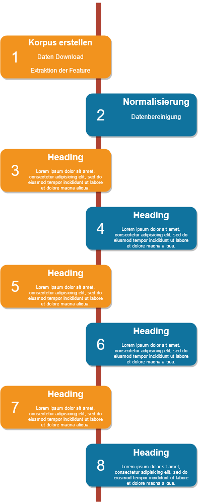

## Abstract

In dieser Arbeit werden drei grundprimitive Algorithmen zur Kategorisierung von Textdaten auf Inhalte der ZDF-Mediathek angewendet und gegenübergestellt. Unter anderem wird die Klassifikationsleistung vom Naiven Bayes Algorithmus, der Logistischen Regression und von Support Vektor Maschinenen (SVM) evaluiert. Dabei werden außerdem verschiedenene Vorprozessierungsschritte und Vektorisierungsmethoden getest. Neben dem Einfluss von Stoppwortlisten, der Stammformreduktion oder der Lemmatisierung werden die Termfrequenz, die One-Hot Enkodierung und das TF-IDF-Maß als Vektorisierungsmethoden erklärt und verglichen. Dazu werden Metadaten der Kategorie Dokumentation aus der Contentschnittstelle des ZDFs geladen. Diese unterteilt sich in diverse Sendungsreihe, die wiederum aus mehreren Rubriken und Sendungen bestehen. Die in den Metadaten enthaltenen textuellen Feature dienen als Ausgangspunkt, für den Kategorisierungsprozess.
Einerseits ermöglicht die ausführliche theoretische Ausarbeitung der Technologien und die Arbeit auf echten Daten, den Kategoriserungsprozess zu verstehen und somit auf andere Problemstellungen und Daten anwenden zu können. Andererseits wird untersucht, welche Kombination aus Vorprozessierung, Vektorisierung und Klassifikation die besten Ergebnisse für das domänenspezifische Datenset liefert.
Die Ergebnisse zeigen, dass die Logistische Regression mit der TF-IDF Enkodierung die besten Ergebnisse liefert. Insbesondere der Abstand zur Leistung von Support Vektor Maschinen ist aber gering. Nur der Naive Bayes schneidet deutlich schlechter ab, als die anderen beiden.

### Daten

Markdown is a lightweight and easy-to-use syntax for styling your writing. It includes conventions for

```markdown
Syntax highlighted code block

# Header 1
## Header 2
### Header 3

- Bulleted
- List

1. Numbered
2. List

**Bold** and _Italic_ and `Code` text

[Link](url) and 
```

For more details see [GitHub Flavored Markdown](https://guides.github.com/features/mastering-markdown/).

### Klassifikationspipeline

.

### Support or Contact

Having trouble with Pages? Check out our [documentation](https://docs.github.com/categories/github-pages-basics/) or [contact support](https://github.com/contact) and we’ll help you sort it out.
