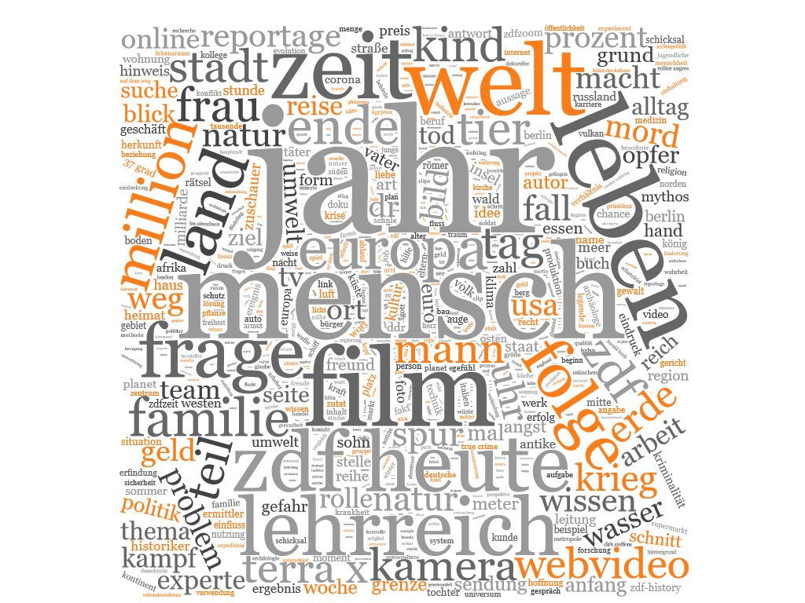
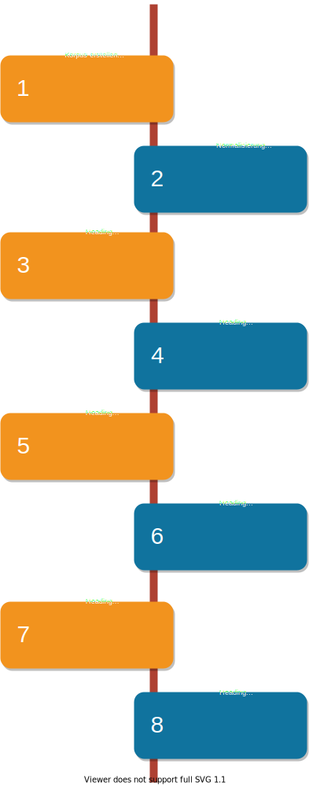

## Abstract

In dieser Arbeit werden drei grundprimitive Algorithmen zur Kategorisierung von Textdaten auf Inhalte der ZDF-Mediathek angewendet und gegenübergestellt. Unter anderem wird die Klassifikationsleistung vom Naiven Bayes Algorithmus, der Logistischen Regression und von Support Vektor Maschinenen (SVM) evaluiert. Dabei werden außerdem verschiedenene Vorprozessierungsschritte und Vektorisierungsmethoden getest. Neben dem Einfluss von Stoppwortlisten, der Stammformreduktion oder der Lemmatisierung werden die Termfrequenz, die One-Hot Enkodierung und das TF-IDF-Maß als Vektorisierungsmethoden erklärt und verglichen. Dazu werden Metadaten der Kategorie Dokumentation aus der Contentschnittstelle des ZDFs geladen. Diese unterteilt sich in diverse Sendungsreihe, die wiederum aus mehreren Rubriken und Sendungen bestehen. Die in den Metadaten enthaltenen textuellen Feature dienen als Ausgangspunkt, für den Kategorisierungsprozess.
Einerseits ermöglicht die ausführliche theoretische Ausarbeitung der Technologien und die Arbeit auf echten Daten, den Kategoriserungsprozess zu verstehen und somit auf andere Problemstellungen und Daten anwenden zu können. Andererseits wird untersucht, welche Kombination aus Vorprozessierung, Vektorisierung und Klassifikation die besten Ergebnisse für das domänenspezifische Datenset liefert.
Die Ergebnisse zeigen, dass die Logistische Regression mit der TF-IDF Enkodierung die besten Ergebnisse liefert. Insbesondere der Abstand zur Leistung von Support Vektor Maschinen ist aber gering. Nur der Naive Bayes schneidet deutlich schlechter ab, als die anderen beiden.

### Datengrundlage

Die ZDF-Mediathek ist in mehrere größerer Rubriken mit vielen Unterkategorien, Sedungsreihen und Einzelsendungen aufgeteilt. Für den Vergleich der verschiedenen Klassifikatoren werden nur Sendungen der Rubrik _Dokumentation_ verwendet, da diese wegen ihrer inhaltlichen Heterogenität besonders spannend ist. Insgesamt besteht der Datensatz aus **6056** Sendungen aufgeteilt auf **10** Sendungsreihen. Die Anzahl der Sendungen ist dabei verzerrt. Sie variiert je nach Reihe von **18** bis zu **1949** Sendungen. Das Vokabular des Korpus besteht aus **105.713** Types und insgesamt **1.427,596** Millionen Tokens. Die durchschnittliche Länge pro Text einer Sendung beträgt **235,74** Tokens.  Sendungen werden mit Tags metakodiert. Die Tags beschreiben dabei strukturelle Merkmale einer Sendungen oder ihren Inhalt. 


### Klassifikationspipeline

.

```markdown
```


### Support or Contact

Having trouble with Pages? Check out our [documentation](https://docs.github.com/categories/github-pages-basics/) or [contact support](https://github.com/contact) and we’ll help you sort it out.
